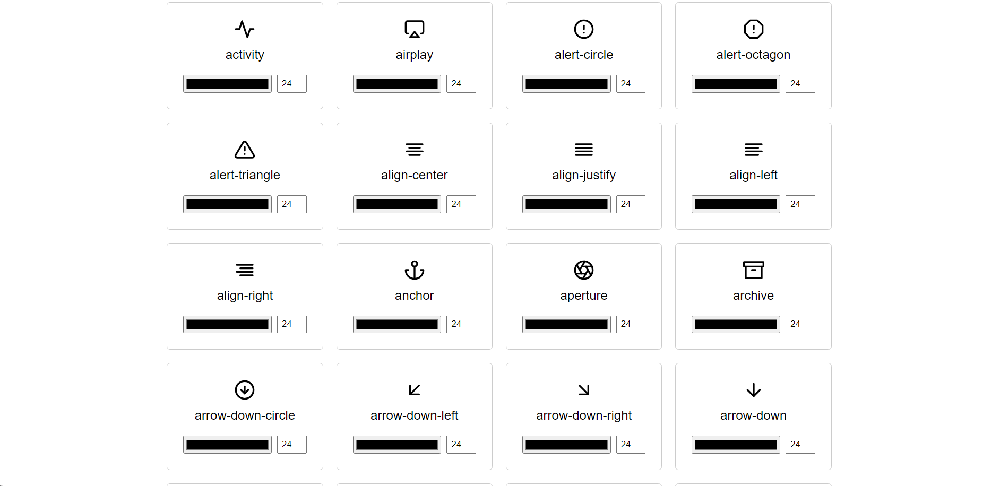

# Feather Icons CDN

[Feather Icons](https://feathericons.com/) is a collection I frequently use across my projects. When working on a project that didn’t support npm, I needed a simple way to include icons without manual downloads. This Express app serves Feather Icons, making them easy to use in any project via a direct URL.

**Live site:** [https://feather-icons.manuelosor.io/icons](https://feather-icons.manuelosor.io/icons)




## Example

```html

```


---

## 🚀 Installation

Clone the repo and install dependencies:

```bash
git clone https://github.com/manuelosorio/feather-icon-cdn.git <project-name>
cd <project-name>
yarn install
```

> You can replace `yarn` with `npm` if preferred.

---

## 📦 Usage

### Build the project

```bash
yarn build
```

### Clean build (removes `dist` before building)

```bash
yarn build:clean
```

---

### Run in development mode

Starts the development server with `nodemon` and `tsup` watching:

```bash
yarn dev
```

---

### Clean the build directory

```bash
yarn clean
```

---
